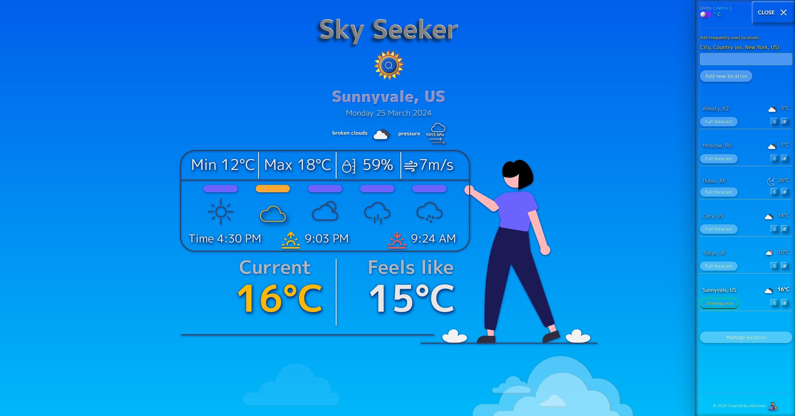

# Sky Seeker weather searching app

[Live demo Sky Seeker](https://cozy-melba-b117ea.netlify.app)

## Scan this QR-code to see the app on your mobile device:

___

## Used technologies:

___

## What is this app for
The Weather Search App is a React.js-based web application designed to provide users with real-time weather information for cities around the world. With an intuitive interface, users can easily search for any city and view its current weather conditions, including temperature, humidity, wind speed, and more.

## Key Features:
* City Search: Users can search for any city by name and instantly retrieve its current weather details.

* Favorite Locations: Users can save their favorite cities to a list for quick access to weather information.

* Manage Favorites: The app allows users to manage their list of favorite locations, including adding, removing, and reordering them.

* Responsive Design: The app is optimized for various screen sizes, ensuring a seamless experience across devices.
___

## How to Use:
* Search: Enter the name of the city and country (ex. New York, US) separated by comma you want to check the weather for in the search bar and press enter.
* In the sidebar menu type city and country (ex. New York, US) separated by comma, and add them to the your favorite list.
* Manage Favorites: To manage your favorite locations, click manage location button, and buttons pop up, where you can edit, remove, or see current weather of selected location.